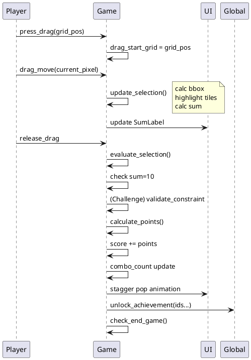
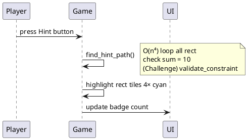
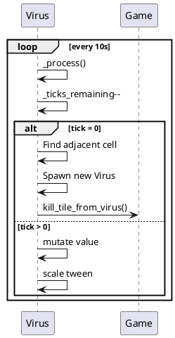
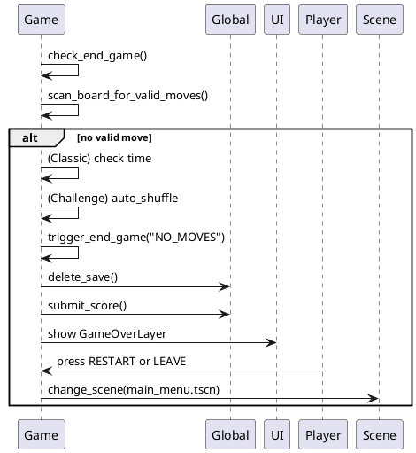
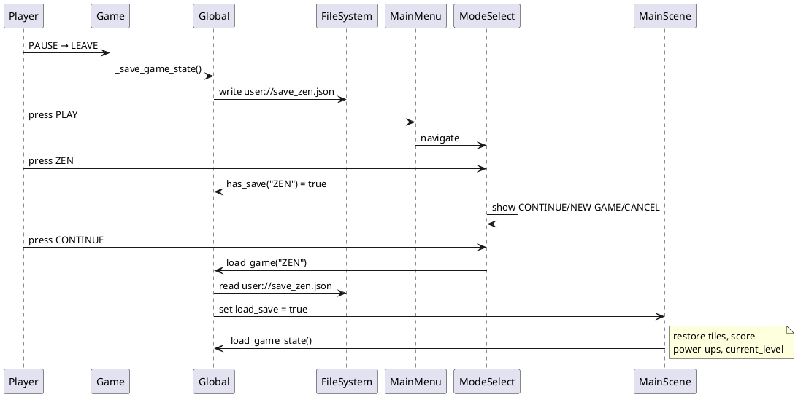

# TraceTen — Report Context (dùng cho Claude web viết báo cáo đồ án)

## 1. Tổng quan dự án

### Thông tin cơ bản
- **Tên game:** TraceTen
- **Mô tả:** Trò chơi giải đố logic 2D tối giản trên nền tảng Android. Người chơi kéo chọn các vùng hình chữ nhật sao cho tổng giá trị các ô số bên trong bằng đúng 10 để ghi điểm.
- **Platform:** Android (local-only, không online)
- **Engine:** Godot 4.x
- **Ngôn ngữ lập trình:** GDScript
- **Lưu trữ:** Local storage (user:// paths)

### Mục tiêu đồ án
- Xây dựng game giải đố đầy đủ tính năng với 5 game mode khác nhau
- Áp dụng các pattern thiết kế hướng đối tượng (OOP) trong GDScript
- Xây dựng hệ thống state management, achievements, highscore
- Thiết kế UI/UX polish cho nền tảng di động
- Hỗ trợ lưu/tải game cho các mode tính điểm cao

---

## 2. Kiến trúc hệ thống

### Sơ đồ tổng quan — Luồng scene và quản lý state

```
main_menu.tscn
    └─ Global (autoload) ← lưu state xuyên scene

    ├─ mode_select.tscn ─┐
    │    └─ Chọn 5 mode │
    │                    │
    │  Save resume popup├─→ main.tscn (gameplay)
    │                    │  └─ trigger_end_game()
    │    New Game ─────────→    submit_score → Global
    │                    │
    └─ achievement_screen.tscn
       highscore.tscn
       tutorial.tscn
```

### Singleton Global (global.gd)
**Vai trò:** Lưu trạng thái xuyên scene, quản lý save/load, achievement, highscore

**Fields quan trọng:**
- `selected_mode: String` — mode hiện tại ("CLASSIC", "ZEN", "GRAVITY", "MUTATION", "CHALLENGE")
- `load_save: bool` — flag để load game trước đó
- `zen_current_level: int` — level hiện tại trong Zen/Challenge (1-12)
- `zen_unlocked_levels: Array` — danh sách level đã unlock
- `_achievements: Dictionary` — {id: {unlocked, progress}}
- `modes_played: Array` — track các mode đã chơi (persist)
- `last_played_mode: String` — mode vừa chơi (dùng cho nút PLAY)

**Methods chính:**
- `save_game(data, mode)` / `load_game(mode)` — lưu/tải game state vào user://save_{mode}.json
- `save_highscore(data)` / `load_highscore()` — quản lý user://highscore.json
- `unlock_achievement(id)` / `update_achievement_progress(id, value)` — phát signal achievement_unlocked
- `submit_score(mode, score, time, max_combo, level, session_id)` — ghi điểm vào highscore, auto-sort top 3/mode; xóa entry cũ cùng session_id trước khi thêm mới (tránh duplicate từ cùng 1 save)
- `save_config()` / `load_config()` — persist last_played_mode

### Luồng chuyển cảnh chính
1. **main_menu** → nhấn PLAY → Global.selected_mode = last_played_mode (hoặc CLASSIC) → load main.tscn
2. **main_menu** → MODES → mode_select.tscn → chọn mode → check Global.has_save(mode) → save resume popup hoặc vào game
3. **main.tscn** (gameplay) → trigger_end_game() → hiện GameOverLayer → RESTART hoặc LEAVE → trở về main_menu

---

## 3. Cấu trúc Class và OOP Hierarchy

### BaseTile (tile.gd) — Base class cho tất cả ô

```gdscript
# Inheritance: extends Area2D, class_name BaseTile

# Fields
var grid_pos: Vector2          # vị trí (x, y) trên grid
var value: int                 # giá trị ô (1–9, hoặc âm)
var tile_type: String          # "NORMAL", "VIRUS", "MYSTERY", "JOKER", "NEGATIVE", "APPLE"
var is_selected: bool          # có trong vùng kéo chọn?
var virus_timer: float         # timer countdown virus (10s per tick)

# Methods
func get_effective_value() -> int
  # Override trong subclass: Joker trả về 0, NORMAL trả về value
func select()       # hiện visual được chọn + tween scale
func deselect()     # ẩn visual, tween scale về bình thường
func flash_wrong()  # flash đỏ khi kéo sai
func _update_type_visuals()  # virtual — subclass override
```

### Subclass: Tile Virus (tile_virus.gd)

```gdscript
# extends BaseTile

# Fields
var _max_ticks: int           # HP max (1-5), hiển thị dấu chấm ở dưới
var _ticks_remaining: int     # HP hiện tại
var _countdown_dots: Array    # hàng dấu chấm visual

# Methods
func _process(delta)
  # Mỗi 10s:
  #   - _ticks_remaining -= 1
  #   - Mutate value: 65% dương [1,9], 30% âm [-5,-1], 5% âm [-9,-6]
  #   - Nếu _ticks = 0 → gọi parent.kill_tile_from_virus(grid_pos)
```

### Subclass: Tile Mystery (tile_mystery.gd)

```gdscript
# extends BaseTile

# Cơ chế
# - Lúc non-select: hiện "?" (hidden style)
# - Lúc select: lộ số thực (revealed style)
# - select() → unlock achievement "first_special"
```

### Subclass: Tile Joker (tile_joker.gd)

```gdscript
# extends BaseTile

# Cơ chế
# get_effective_value() → return 0
# - Khi kéo: hiểu như ô trống
# - Khi chốt (evaluate_selection):
#   if sum_without_joker + needed = 10, needed ∈ [-9,9] → tính joker = needed
#   else → sum = 999 (overload, fail)
```

### Subclass: Tile Negative (tile_negative.gd)

```gdscript
# extends BaseTile

# Cơ chế
# value ∈ [-9, -1] (xác suất trong Mutation mode)
# Hiển thị màu đỏ (NEG_BG)
```

### Subclass: Tile Apple (tile_apple.gd) — chỉ Gravity mode

```gdscript
# extends BaseTile

# Cơ chế
# - Vẽ hình quả táo bezier (apple_draw.gd)
# - Stem (cây) xoay theo hướng gravity hiện tại
# - Value: 1-9 random
```

### TileFactory (tile_factory.gd) — Factory pattern

```gdscript
# class_name TileFactory

static func roll(mode: String) -> Dictionary
  # Trả về {type: "...", val: N}
  # - CLASSIC/ZEN/MUTATION: roll random type + value
  # - GRAVITY: type="APPLE", val=weighted_normal

static func _weighted_normal_val() -> int
  # Weighted distribution 1–9:
  # 1:15% 2:15% 3:15% 4:13% 5:13% 6:10% 7:8% 8:6% 9:5%
  # (Tăng xác suất 1–5 để có nhiều combo sum=10)

static func _roll_mutation() -> Dictionary
  # Custom cho Mutation mode:
  # - Negative: 25% (-5→-1), 5% (-9→-6)
  # - Mystery: 19.5%
  # - Joker: 1%
  # - Virus: 6%
  # - Rest: Normal/Negative ~73.5%

static func make(type: String) -> BaseTile
  # Tạo tile node, gán script phù hợp (SCRIPTS dict)
```

### Main (main.gd) — Game coordinator (file ~2500 lines)

**Vai trò:**
- Quản lý board logic, input, evaluation, scoring
- Xử lý 5 game mode: CLASSIC, ZEN, GRAVITY, MUTATION, CHALLENGE
- Trigger end game, apply gravity, manage power-ups
- Ghi điểm, save/load, achievement tracking

**Key Fields:**
```gdscript
var grid_cols = 8, grid_rows = 12, tile_size = 105
var tiles: Dictionary                    # {Vector2(x,y): BaseTile node}
var gameplay_mode: String                # mode hiện tại
var score: int, max_combo: int          # điểm + combo cao nhất trong game
var combo_count: int                     # combo hiện tại (x1, x2, ...)
var last_score_time: float               # Unix timestamp lần score cuối
const COMBO_TIMEOUT = 5.0                # 5s để tính combo mới
const COMBO_MAX = 5                      # Cap combo ở x5

# Gravity
var gravity_level: int                   # 1=DOWN, 2=RIGHT, 3=LEFT, 4=RANDOM
var gravity_l4_dir: String               # hướng random ở level 4

# Zen/Challenge
var zen_milestone_count: int             # mốc refill power-up (50 điểm/lần)
const ZEN_REFILL_MILESTONE = 100         # Zen: 100pts/refill, Challenge: 50pts

# Power-ups
var hint_count, shuffle_count, remove_count: int   # counts (stackable)
var is_remove_mode: bool                 # đang chờ chọn ô remove?
```

**Methods chính:**

1. **Setup & Board:**
   - `setup_mode_config()` — init config riêng từng mode
   - `spawn_grid()` — tạo board 8×12, retry tối đa 5 lần nếu CLASSIC không có move hợp lệ
   - `_spawn_challenge_board()` — generate board via ZenBoardGenerator

2. **Input & Selection:**
   - `handle_rectangle_input(event)` — drag chọn vùng
   - `update_selection(touch_pos)` — tính bbox, highlight tile trong vùng
   - `pixel_to_grid(pixel_pos)` — convert touch tọa độ → grid

3. **Evaluation:**
   - `evaluate_selection()` — check sum=10, constraint (Challenge), calculate_points, trigger animations, check end game
   - `calculate_points(sel_tiles)` → int
   - `is_valid_sum_10(tiles)` → bool — check tổng (Joker được phép "adapt")

4. **Hint & Scan:**
   - `find_hint_path()` → Array — O(n⁴) loop all rect, check sum=10 + constraint (Challenge)
   - `scan_board_for_valid_moves()` → bool — reuse find_hint_path, dùng để end game check

5. **Power-ups:**
   - `_on_btn_hint_pressed()` — highlight rect 4 ticks
   - `_on_btn_shuffle_pressed()` — xáo lại board (Challenge: retry 5×, nếu vẫn fail → refill board mới)
   - `_on_btn_remove_pressed()` — toggle remove mode, select 1 ô để xóa

6. **Gravity:**
   - `apply_gravity()` — theo hướng gravity hiện tại
   - `check_gravity_level_up()` — level up mỗi 50 điểm, đổi hướng

7. **Virus:**
   - `kill_tile_from_virus(pos)` — tile virus hết HP, lan sang ô liền kề ngẫu nhiên, -1 penalty

8. **End Game:**
   - `trigger_end_game(reason)` — "TIME_UP", "NO_MOVES", "NO_LIVES", "LEFT"
   - `check_end_game()` → scan board, check power-up, trigger if no move

9. **Zen Milestones:**
   - `_check_zen_milestone()` — cứ 50 pts (Challenge) / 100 pts (Zen/Mutation) = +1/+3 power-up
   - `_check_zen_level_unlock()` — unlock level mới, apply theme

### ZenLevelManager (scripts/zen_level_manager.gd)

```gdscript
class_name ZenLevelManager

static func validate_constraint(rect: Rect2i, tile_count: int, level: int) -> Dictionary
  # Check constraint của level hiện tại
  # Trả về {valid: bool, reason: String}

static func get_constraint_text(level) -> String
  # E.g., "Square region (>= 3x3), >= 5 tiles"

static func get_unlock_score(level) -> int
  # Điểm cần unlock level này

static func is_last_level(level) -> bool
  # Level 12 = cuối cùng?
```

### ZenBoardGenerator (scripts/zen_board_generator.gd)

```gdscript
class_name ZenBoardGenerator

static func generate(level: int) -> Dictionary
  # Trả về board dict: {Vector2(x,y): {val, type}, ...}
  # Algorithm:
  # 1. Pick solution rect thỏa constraint
  # 2. Pick min_tiles vị trí spanning full rect
  # 3. Generate N số tổng = 10
  # 4. Fill phần còn lại random (không overlap solution rect để có holes)

static func _pick_solution_rect(rules, min_tiles) -> Rect2i
  # Chọn hình chữ nhật phù hợp constraint (vuông, min_bbox_size, min_bbox_area, etc.)

static func _generate_summing_to_10(count) -> Array
  # Partition 10 thành count số [1,9], tối đa 50 attempt
```

### ZenLevels (data/zen_levels.gd) — Data-driven config

```gdscript
class_name ZenLevels

const LEVELS = [
  # L1: {name="Meadow", unlock=0, constraints={min_tiles:3}, ...}
  # L2: {name="Forest", unlock=50, constraints={min_tiles:3, min_bbox_area:4}, ...}
  # ...
  # L12: {name="Cosmos", unlock=3500, constraints={min_bbox_area:16, min_tiles:8}, ...}
]
```

**12 Level Detail:**

| # | Tên | Unlock | Constraint | Biểu tượng |
|---|---|---|---|---|
| 1 | Meadow | 0 | ≥3 ô | ▭▭▭ |
| 2 | Forest | 50 | ≥3 ô, area≥4 | ▭▭▭ + □ |
| 3 | Riverside | 150 | Vuông 2×2+ | ▦ |
| 4 | Ocean Shore | 300 | ≥4 ô, area≥6 | ▭▭▭▭ |
| 5 | Deep Sea | 500 | 2×3 region, ≥4 | ▦▭ |
| 6 | Coral Reef | 750 | Vuông 3×3+ | ▦ |
| 7 | Desert | 1000 | ≥5 ô, area≥8 | ▭▭▭▭▭ |
| 8 | Canyon | 1300 | 3×3 region, ≥5 | ▦▦ |
| 9 | Mountain | 1700 | ≥6 ô, area≥9 | ▭...▭ |
| 10 | Snow Peak | 2200 | area≥12, ≥6 | ▦▦ |
| 11 | Aurora | 2800 | ≥7 ô, area≥12 | ▭...▭ |
| 12 | Cosmos | 3500 | area≥16, ≥8 | ▦▦▦ |

### AchievementData (data/achievements.gd)

```gdscript
class_name AchievementData

const LIST = [
  # 5 Beginner (first_ten, first_powerup, all_modes, first_combo, first_special)
  # 3 Score (score_100, score_500, score_1000)
  # 3 Combo (combo_5, combo_10, combo_classic)
  # 7 Mode (classic_survive, gravity_lv4, gravity_3lives, zen_refill3, challenge_l6, challenge_l12, mutation_alltype)
  # 3 Special Tiles (virus_cleared, joker_used, negative_win)
  # 4 Quirky (big_selection, no_hint, cancel_remove, virus_explode)
]
```

---

## 4. Game Mode — Đặc điểm từng mode

### CLASSIC (120s countdown)
- **Input:** Rectangle drag
- **Timer:** Real-time countdown (không dừng khi pause)
- **End game:** Time's up; hết nước + còn giờ → `_classic_board_refill()` (board mới, không gameover); hết nước + hết giờ → NO_MOVES (edge case hiếm)
- **Score formula:** base = tile_count × combo
- **Save:** Không save (one-shot game)

### ZEN (Unlimited)
- **Input:** Rectangle drag
- **Timer:** Pause-aware count-up (accumulated_time += delta khi không pause)
- **End game:** Hết nước + hết power-up
- **Power-up refill:** Mỗi 100 điểm → +1 hint/shuffle/remove (stackable)
- **Save:** Ghi/đọc user://save_zen.json
- **Level:** 12 level, theme màu biome khác nhau, HUD hiện tên level — nhưng **không áp constraint shape** (constraint chỉ có ở Adventure)
- **Unlock level:** Tương ứng unlock_score

### GRAVITY (150s countdown, 3 lives, level progression)
- **Input:** Rectangle drag
- **Timer:** Real-time (như Classic)
- **Lives:** Shuffle = mạng (3 → 2 → 1 → 0 = game over)
- **Gravity:** Level 1=DOWN, 2=RIGHT, 3=LEFT, 4=RANDOM (mỗi nước random)
- **Level up:** Mỗi 50 điểm → next level + change direction
- **Time bonus:** +1s/tile ăn được
- **Refill:** Khi 85% ô trống → `refill_empty_slots()`: spawn toàn bộ ô trống
- **Score formula:** base = tile_count × combo
- **Save:** Không save
- **End game:** Time up, No lives (không có NO_MOVES — hết nước → tự -1 mạng + board mới)

### MUTATION (Unlimited, count-up)
- **Input:** Rectangle drag
- **Timer:** Pause-aware count-up
- **Tiles đặc biệt:**
  - Mystery 19.5%
  - Joker 1%
  - Virus 6%
  - Negative 25%
  - Normal 48.5%
- **Score bonus:**
  - Joker +5
  - Negative +3
  - Mystery +2
  - Virus +10
- **Refill:** Khi 70% ô trống → `refill_empty_slots()`: spawn toàn bộ ô trống
- **Power-up refill:** Mỗi 100 điểm → +1 hint/shuffle/remove (giống Zen)
- **End game:** No move + no power-up

### CHALLENGE / ADVENTURE (12 level, count-up)
- **Input:** Rectangle drag
- **Timer:** Pause-aware count-up
- **Constraint:** Mỗi level khác → Shape check bắt buộc
- **Board gen:** Smart (ZenBoardGenerator) — guaranteed solvable
- **End game:** No move + no power-up
  - **Auto-shuffle:** Thử shuffle 5× tìm valid move
  - **Auto-refill:** Nếu vẫn fail → spawn board mới (guaranteed valid)
- **Power-up refill:** Mỗi 50 điểm (+3 count)
- **Save:** user://save_challenge.json
- **Progress:** Ghi level_reached → highscore track progression

---

## 5. Luồng gameplay chính — Flow Diagram

### Flow 1: Player kéo chọn → Evaluate → Score → Combo

```
player.drag_start_grid = grid_pos
↓
player.drag_move → update_selection()
  └─ calc bbox (min_x, max_x, min_y, max_y)
  └─ highlight tile trong bbox
  └─ calc sum (dùng get_effective_value → Joker = 0, khác = value)
  └─ update SumLabel (màu: under=xanh mềm, exact=mint, over=đỏ)
↓
player.drag_release → evaluate_selection()
  ├─ check has_joker → calc joker needed
  ├─ if sum != 10 → flash_wrong, reset combo, return
  ├─ (Challenge) validate_constraint() → nếu fail, "Wrong shape!", reset combo, return
  ├─ calculate_points(selected_tiles)
  │   ├─ base = (Classic/Gravity: tile_count) OR (Zen/Mutation/Challenge: bbox_area if density≥0.3)
  │   ├─ bonus = (Mutation chỉ: +5 Joker/+3 Neg/+2 Mystery/+10 Virus)
  │   ├─ result = (base + bonus) × min(combo_count, 5)
  ├─ score += points
  ├─ combo_count = (now - last_score_time ≤ 5s) ? combo_count + 1 : 1
  ├─ last_score_time = now (real time)
  ├─ max_combo = max(max_combo, combo_count)
  ├─ Stagger tile pop (delay 30ms, scale 1.0→1.15→0)
  ├─ Spawn burst particles + score chip pop-up
  ├─ await 0.5–0.6s
  ├─ Check gravity level up (Gravity) / zen milestone (Zen/Challenge)
  ├─ Check refill (Zen/Mutation/Challenge: khi 70% ô trống → refill_empty_slots() — spawn toàn bộ ô trống)
  └─ check_end_game()
```

### Flow 2: Power-up Hint

```
player.press_Hint → _on_btn_hint_pressed()
  ├─ hint_count -= 1
  ├─ Global.hints_used_this_game += 1
  ├─ find_hint_path()
  │   ├─ O(n⁴) loop: for x1, y1, x2, y2 → rect
  │   ├─ Collect tiles in rect
  │   ├─ Check is_valid_sum_10() (+ Joker adapt)
  │   ├─ (Challenge) validate_constraint()
  │   └─ return first valid rect
  ├─ Flash tile 4 lần cyan
  └─ update_power_up_ui()
```

### Flow 3: Gravity apply

```
evaluate_selection() → (Gravity mode)
  ├─ add time_bonus = eaten_tiles × 1.0s
  ├─ check_gravity_level_up() (mỗi 50 pts level up)
  ├─ apply_gravity() → await 0.2s
  │   ├─ match direction: DOWN/UP/LEFT/RIGHT
  │   ├─ For each column/row: shift tiles to fill empty
  │   ├─ Tile move animation (0.3s bounce tween)
  │   └─ L4: random next direction
  ├─ Khi 85% ô trống: refill_empty_slots() — spawn toàn bộ ô trống
  └─ check_end_game()
```

### Flow 4: Virus Tick & Spread

```
virus_tile._process(delta):
  ├─ virus_timer += delta
  ├─ if virus_timer ≥ 10s:
  │   ├─ virus_timer = 0
  │   ├─ _ticks_remaining -= 1
  │   ├─ if _ticks = 0:
  │   │   ├─ Find adjacent non-virus tile (random)
  │   │   ├─ Erase old tile, spawn new VIRUS at that cell
  │   │   ├─ kill_tile_from_virus(grid_pos) in parent:
  │   │   │   ├─ Re-roll virus value
  │   │   │   ├─ Reset virus_timer
  │   │   │   ├─ Show -1 penalty
  │   │   │   ├─ Flash screen red
  │   │   │   └─ Unlock "virus_explode" achievement
  │   │   └─ return
  │   ├─ Else: mutate value (65% dương, 30% âm [-5,-1], 5% âm [-9,-6])
  │   └─ Scale tween 1.2× → 1×
```

### Flow 5: End Game Trigger

```
check_end_game():
  ├─ (Gravity) _check_gravity_end_game():
  │   ├─ if scan_board_for_valid_moves() → return (còn nước)
  │   ├─ if hint_count > 0 OR remove_count > 0 → flash button, return
  │   ├─ if shuffle_count > 0 → -1 life, _gravity_force_new_board(), return
  │   └─ else → trigger_end_game("NO_LIVES")
  ├─ (Classic/Zen/Mutation/Challenge) if hint/shuffle/remove > 0 → return
  ├─ if not scan_board_for_valid_moves():
  │   ├─ (Classic) if time_remaining > 0 → _classic_board_refill(): xóa sạch tất cả tiles + spawn_grid() lại từ đầu, return
  │   ├─ (Challenge) auto_shuffle (retry 5×) → nếu fail refill board
  │   └─ else → trigger_end_game("NO_MOVES")

trigger_end_game(reason):
  ├─ Global.delete_save(gameplay_mode)
  ├─ Global.submit_score(mode, score, time_played, max_combo, level, session_id)
  ├─ (Achievement) check: classic_survive (time remaining ≥ 60s), no_hint
  ├─ Update GameOverLayer (icon, reason text, stats)
  └─ Show GameOverLayer (RESTART / LEAVE buttons)

_on_btn_quit_pressed() (Zen/Mutation/Adventure — pause → Leave):
  ├─ if score > _last_submitted_score:
  │   └─ Global.submit_score(..., session_id)  ← chỉ submit khi tăng điểm
  │       └─ xóa entry cũ cùng session_id trước, thêm entry mới
  ├─ _last_submitted_score = score
  └─ _save_game_state()  ← ghi session_id + last_submitted_score vào save
```

---

## 6. Sequence Diagram (Text format cho PlantUML)

### SD1: Player kéo chọn vùng



### SD2: Hint được dùng



### SD3: Virus tick & spread



### SD4: Game Over trigger



### SD5: Save/Load Zen Game



---

## 7. Hệ thống điểm chi tiết

### calculate_points() Algorithm

```gdscript
func calculate_points(sel_tiles: Array) -> int:
    var base: int

    # Bước 1: Tính base
    if gameplay_mode in ["ZEN", "MUTATION", "CHALLENGE"]:
        # Tính bbox từ tile position thực
        var min_x = ...; var max_x = ...
        var min_y = ...; var max_y = ...
        for pos in sel_tiles:
            min_x = min(min_x, pos.x); max_x = max(max_x, pos.x)
            min_y = min(min_y, pos.y); max_y = max(max_y, pos.y)

        var bbox_area = (max_x - min_x + 1) * (max_y - min_y + 1)
        var tile_count = sel_tiles.size()
        var density = float(tile_count) / float(bbox_area)

        if density < 0.3:
            base = tile_count  # Penalize sparse bbox
        else:
            base = bbox_area   # Reward dense bbox
    else:
        # Classic, Gravity
        base = sel_tiles.size()

    # Bước 2: Mutation bonus
    var bonuses = 0
    if gameplay_mode == "MUTATION":
        for pos in sel_tiles:
            match tiles[pos].tile_type:
                "JOKER":    bonuses += 5
                "NEGATIVE": bonuses += 3
                "MYSTERY":  bonuses += 2
                "VIRUS":    bonuses += 10

    # Bước 3: Nhân combo (capped x5)
    return (base + bonuses) * min(combo_count, COMBO_MAX)
```

### Combo Multiplier

- **Trigger:** 5 giây giữa 2 lần score thành công
- **Real-time check:** Dùng `Time.get_unix_time_from_system()` (không dừng khi pause)
- **Cap:** x5 (COMBO_MAX)
- **Escalation:** x2=1.2× scale, x3=1.3×, x4=1.4×, x5+=1.5×

### Density Threshold

- **Mục đích:** Chặn farming bằng cách kéo vùng dài ra phía ô trống
- **Logic:** Nếu `tile_thật / bbox_area < 0.3` → tính từ tile count thay vì bbox
- **Ví dụ:**
  - 5 tile rải rác → bbox 8×12 = 96 → density = 0.05 → base = 5
  - 5 tile chặt → bbox 3×2 = 6 → density = 0.83 → base = 6

---

## 8. Hệ thống Ô Đặc Biệt (Special Tiles)

### Joker (tile_joker.gd)

- `get_effective_value()` → 0 (khi kéo chọn)
- Khi evaluate: `needed = 10 - sum_without_joker`
  - Nếu `needed ∈ [-9, 9]` → tổng = 10 (pass)
  - Ngược lại → tổng = 999 (fail)
- Achievement: "joker_used" khi joker thành công

### Virus (tile_virus.gd)

- HP ngẫu nhiên 1–5 ticks
- Mỗi 10s: mutate value + HP--
- HP = 0: lan sang ô liền kề, trừ -1 điểm
- Dọn trước khi nổ: +10 bonus (Mutation), unlock "virus_cleared"

### Mystery (tile_mystery.gd)

- Hiển thị "?" → select để lộ số thực
- Lần đầu chạm: unlock "first_special"
- Bonus (Mutation): +2 điểm

### Negative (tile_negative.gd)

- Giá trị âm [-9, -1]
- Hữu dụng để balance số dương lớn (vd: [9, 8, -7] = 10)
- Bonus (Mutation): +3 điểm
- Achievement: "negative_win"

### Apple (tile_apple.gd) — Gravity mode

- Vẽ hình quả táo bezier (apple_draw.gd)
- Stem xoay theo hướng gravity hiện tại
- Giá trị 1–9 random

---

## 9. Hệ thống Achievement (25 thành tựu)

### Danh sách theo Category

#### Beginner (5)
| ID | Tên | Điều kiện |
|----|-----|-----------|
| first_ten | Hello, Ten! | Ghi điểm lần đầu |
| first_powerup | Helping Hand | Dùng power-up lần đầu |
| all_modes | Explorer | Chơi 5 mode (persist qua session) |
| first_combo | On a Roll | Đạt x2 combo |
| first_special | What's This? | Select Mystery tile lần đầu |

#### Score (3)
| ID | Tên | Điều kiện |
|----|-----|-----------|
| score_100 | Century | ≥100 pts trong 1 game |
| score_500 | High Roller | ≥500 pts |
| score_1000 | Four Digits | ≥1000 pts |

#### Combo (3)
| ID | Tên | Điều kiện |
|----|-----|-----------|
| combo_5 | Pentagram | Đạt x5 combo |
| combo_10 | Unstoppable | Land 5 hits liên tiếp khi ở x5 |
| combo_classic | Speed Demon | Đạt x5 trong Classic |

#### Mode-Specific (7)
| ID | Tên | Điều kiện | Mode |
|----|-----|-----------|------|
| classic_survive | Against the Clock | Kết thúc Classic, ≥60s remaining | Classic |
| gravity_lv4 | Gravitational Pull | Lên Level 4 | Gravity |
| gravity_3lives | Untouchable | Đến L3 không mất mạng | Gravity |
| zen_refill3 | Zen Garden | Trigger refill 3 lần (300 pts) | Zen |
| challenge_l6 | Cube Master | Unlock L6 Coral Reef (3×3 square) | Adventure |
| challenge_l12 | Cosmos | Unlock L12 | Adventure |
| mutation_alltype | Collector | Dọn 4 loại tile đặc biệt trong 1 game | Mutation |

#### Special Tiles (3)
| ID | Tên | Điều kiện |
|----|-----|-----------|
| virus_cleared | Defused | Dọn Virus trước khi nổ |
| joker_used | Wild Card | Dùng Joker thành công |
| negative_win | Glass Half Empty | Dùng âm để balance sum=10 |

#### Quirky/Secret (4)
| ID | Tên | Điều kiện |
|----|-----|-----------|
| big_selection | Hoarder | Select ≥20 ô trong 1 nước |
| no_hint | I Don't Need Help | Finish Classic không dùng Hint |
| cancel_remove | Never Mind | Cancel Remove mode (bấm Remove 2×) |
| virus_explode | Oops | Để Virus nổ lần đầu |

### Tracking Mechanism

- **Per-game (reset):** `hints_used_this_game`, `_mutation_types_cleared`
- **Persist:** `modes_played[]` (user://achievements.json)
- `unlock_achievement(id)` → idempotent, emit signal → popup
- `update_achievement_progress(id, value)` → auto-unlock khi value ≥ target

---

## 10. Hệ thống Highscore & Save/Load

### Files lưu trữ

| File | Nội dung |
|------|----------|
| `user://save_zen.json` | Zen game state |
| `user://save_mutation.json` | Mutation game state |
| `user://save_challenge.json` | Challenge/Adventure game state |
| `user://highscore.json` | Top 3 per mode |
| `user://config.json` | last_played_mode |
| `user://achievements.json` | 25 achievement + _modes_played |

### Game State Format (Zen/Mutation/Challenge)

```json
{
  "score": 287,
  "accumulated_time": 1840.5,
  "current_level": 3,
  "unlocked_levels": [1, 2, 3, 4],
  "max_combo": 5,
  "last_submitted_score": 200,
  "session_id": "1749600000",
  "board_state": [
    {"pos": [0, 0], "val": 5, "type": "NORMAL"},
    {"pos": [1, 0], "val": 8, "type": "MYSTERY"}
  ],
  "powerups": {"hint": 2, "shuffle": 1, "remove": 3}
}
```

### Highscore Format

```json
{
  "CLASSIC": [
    {"score": 1250, "time": 85.3, "max_combo": 7, "date": "Jun 5", "level": 0, "session_id": "1749600000"}
  ],
  "CLASSIC_meta": {"games": 15, "total_score": 12500}
}
```

**Cơ chế chống duplicate (Zen/Mutation/Adventure):**
- Mỗi game session có `session_id` = Unix timestamp lúc bắt đầu, lưu trong save file
- Khi Leave: chỉ submit nếu `score > last_submitted_score`
- `submit_score` xóa entry cũ cùng `session_id` trước khi thêm mới → cùng 1 save chỉ chiếm 1 slot highscore dù Leave nhiều lần
- `games` count chỉ tăng lần đầu submit của mỗi session; `total_score` swap điểm cũ → mới
```

---

## 11. Adventure Mode — Level System Chi tiết

### Constraint Validation Logic

```gdscript
# ZenLevelManager.validate_constraint(rect: Rect2i, tile_count, level)
# Check theo thứ tự:
# 1. min_tiles
# 2. min_bbox_area
# 3. must_be_square
# 4. min_square_size
# 5. min_bbox_size (flexible orientation: w×h hoặc h×w đều OK)
```

### Smart Board Generation Algorithm

1. **Pick solution rect:** từ constraint, tính min size → random position
2. **Pick solution tiles:** 2 anchor corners (guaranteed spanning) + random fills
3. **Generate numbers summing to 10:** partition algorithm, 50 attempt tối đa
4. **Fill remaining:** ô ngoài rect random; ô trong rect không phải solution = lỗ

---

## 12. Test Cases Đề xuất

### Functional Tests

| Category | Test | Expected |
|----------|------|----------|
| Selection | Drag 2×2, sum=10 | Score ghi |
| Selection | Drag, sum<10 | Flash wrong, no score |
| Selection | Drag, sum>10 | Flash wrong, no score |
| Joker | [8, 4, Joker] | sum=10 OK |
| Joker | [9, 9, 9, Joker] needed=-17 | Fail (out of range) |
| Combo | Score 2 lần trong 5s | x2 multiplier |
| Combo | 5s timeout | Combo reset |
| Combo | Drag sai tổng (sum ≠ 10) | Combo reset, last_score_time = 0 |
| Combo | Drag sai shape (Adventure) | Combo reset, last_score_time = 0 |
| Combo | combo=6 | Capped at x5 |
| Gravity | Down gravity | Tiles ngã xuống |
| Gravity | Level up mỗi 50 pts | Direction change |
| Virus | HP 1-5 countdown | Tick mỗi 10s |
| Virus | HP=0 | Spread + -1 penalty |
| Power-up Hint | Press Hint | Highlight valid rect |
| Power-up Shuffle | Press Shuffle | Board xáo có valid move |
| Power-up Remove | Press Remove 2× | Cancel mode |
| End Game | Classic time up | "TIME_UP" screen |
| End Game | No moves + no power-up | "NO_MOVES" screen |
| Save/Load | Zen LEAVE | save_zen.json created |
| Save/Load | CONTINUE | Board + score restored |
| Achievement | Score lần đầu | "first_ten" popup |
| Achievement | All modes | "Explorer" popup |

### Edge Cases

| Case | Expected |
|------|----------|
| Virus spawn khi board đầy | Không tìm được ô, không crash |
| Drag vượt grid boundary | Clamp không error |
| Pause + resume | Zen timer chính xác (pause-aware) |
| Challenge no valid move | Auto-shuffle → auto-refill |
| Joker + Mystery trong vùng | Joker adapt lên tổng sau reveal |

### Android / Device Tests

| Test | Expected |
|------|----------|
| Touch drag responsive | Không lag trên mid-range device |
| Alt-tab | Classic/Gravity timer tiếp tục; Zen pause |
| Viewport 720×1280 | Tile size tự tính, board fit |
| APK build | DEBUG_MODE = false trước khi build |

---

## 13. Các hằng số quan trọng

```gdscript
# Grid
GRID_COLS = 8, GRID_ROWS = 12
TILE_VISUAL_RATIO = 0.90    # 90% cell = ~10% gap visual

# Combo
COMBO_TIMEOUT = 5.0
COMBO_MAX = 5

# Scoring bonus (Mutation)
JOKER_BONUS = 5, NEGATIVE_BONUS = 3, MYSTERY_BONUS = 2, VIRUS_BONUS = 10

# Gravity
GRAVITY_LEVEL_SCORE = 50
GRAVITY_TIME_PER_TILE = 1.0
VIRUS_SPREAD_PENALTY = 1

# Zen/Challenge refill
ZEN_REFILL_MILESTONE = 100      # +1 power-up
CHALLENGE_REFILL_MILESTONE = 50 # +3 power-ups

# Virus
VIRUS_TICK_INTERVAL = 10.0
VIRUS_HP_MIN = 1, VIRUS_HP_MAX = 5

# Density check (Zen/Mutation)
DENSITY_THRESHOLD = 0.3
```

---

## 14. Quyết định thiết kế & Known Limitations

### Quyết định Thiết kế Chính

1. **Rectangle selection:** Đơn giản, responsive trên touch
2. **Weighted distribution 1–9:** Tăng 1–5 → nhiều combo sum=10
3. **Density threshold 0.3:** Balance giữa farming vs legitimate play
4. **Combo real-time clock:** Không dừng khi pause (acceptable, COMBO_TIMEOUT=5s ngắn)
5. **Tile visual gap = scale 0.90:** Tránh hitbox gap complexity
6. **Gravity 70% refill:** Đủ tile, không quá đơn giản
7. **Challenge auto-shuffle:** Constraint có thể lock → auto-refill guaranteed solvable
8. **Smart board gen:** Guaranteed 1 valid move, tránh impossible level
9. **Combo cap x5:** Reward đủ, không unbalanced
10. **Achievement "_modes_played" persist:** Detect "all_modes" across session

### Known Limitations

- **No online:** Local highscore chỉ, không cloud sync
- **Tile hitbox NOT scaled:** TILE_VISUAL_RATIO chỉ áp visual
- **Combo timer real-clock:** Không dừng khi pause
- **No undo:** Move không thể revert
- **scan_board O(n⁴):** Chỉ call sau action, không trong `_process()`

---

## 15. Thuật ngữ & Ghi chú Kỹ thuật

### Thuật ngữ chính

| Thuật ngữ | Giải thích |
|-----------|-----------|
| Grid | Bàn cờ 8×12 ô |
| Tile | Một ô (BaseTile node) |
| Selection | Vùng kéo chọn (hình chữ nhật) |
| Sum | Tổng giá trị ô trong vùng |
| Valid | Sum=10 AND constraint pass |
| Bbox | Bounding box (min/max x,y) |
| Combo | Nhân số ×1 đến ×5 |
| Density | Ratio tile thật / bbox area |
| Refill | Spawn tile mới vào empty slot |
| Gravity | Tiles rơi theo direction |
| Constraint | Shape requirement — chỉ Adventure mode |
| Spread | Virus lây sang ô liền kề |

### Naming Convention

- `snake_case` cho biến/hàm
- `PascalCase` cho class
- `UPPER_SNAKE_CASE` cho constant
- Tile type: `"NORMAL"`, `"VIRUS"`, `"MYSTERY"`, `"JOKER"`, `"NEGATIVE"`, `"APPLE"`
- Mode: `"CLASSIC"`, `"ZEN"`, `"GRAVITY"`, `"MUTATION"`, `"CHALLENGE"`

### Godot 4 / GDScript Features Used

- `extends` inheritance, `class_name` declaration
- `preload()` resource caching
- `Tween` for animation, `Signal` for event system
- `Dictionary` for dynamic data, `@onready` for node reference
- `match` switch-case, lambda functions, `Color("#HEX")`
- `FileAccess` for JSON save/load
- `GPUParticles2D` for VFX
- `CanvasLayer` for overlay UI (achievement popup)

---

*End of Report Context — TraceTen v0.7 (2026-06-09)*
*Đủ thông tin để viết báo cáo đồ án, vẽ Use Case / Class / Sequence / Activity Diagram, và thiết kế test cases.*
